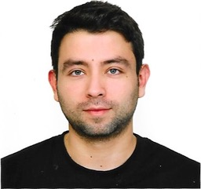

---
# library(xaringan)
# xaringan::inf_mr()
title: "CV de César CEBALLOS"
# author: Cesar CEBALLOS
date: "`r Sys.Date()`"
output:
  pagedown::html_resume: 
    # set it to true for a self-contained HTML page but it'll take longer to render
    self_contained: false
# uncomment this line to produce HTML and PDF in RStudio:
knit: pagedown::chrome_print 
# If this previous line don't wort you can try in your console:
# pagedown::chrome_print("Cesar_R.html", format = "pdf", verbose = 2)
---
Aside
================================================================================

{width=60%}

CONTACT {#contact}
--------------------------------------------------------------------------------

- <i class="fa fa-envelope"></i> cesarceballos0126@gmail.com
- <i class="fa fa-linkedin"></i> [linkedin.com/cesarceballos0126](https://www.linkedin.com/in/cesarceballos0126)
- <i class="fa fa-phone"></i> (+33) 0625982839

CERTIFICATIONS {#skills}
--------------------------------------------------------------------------------
- ISTQB Certified Tester niveau fondation. 
- Scrum.org	PSD I - Professional Scrum Developper I
- Salesforce	Administrator (ADM201)

LANGUES {#skills}
--------------------------------------------------------------------------------

- Anglais : Lu, Ecrit, Parlé (Notion)
- Espagnol : Lu, Ecrit, Parlé (Langue maternelle/Bilingue)
- Français : Lu, Ecrit, Parlé (Courant)

METHODES {#skills}
--------------------------------------------------------------------------------
- Gestion de projets : Méthode des 6 chapeaux / Scrum Agile 
- Planification : GANTT

Main
================================================================================

César CEBALLOS {#title}
--------------------------------------------------------------------------------

### Data Scientist

César est un consultant en data science, il compte avec 6 années d’expérience, sa formation initiale en économie/finance et son parcours en informatique font de lui un consultant capable d’intervenir aussi bien sur les aspects techniques d’un projet comme l’exécution et analyses de tests que sur la partie fonctionnelle, notamment dans les métiers de la finance.

Compétences {data-icon=chart-line}
--------------------------------------------------------------------------------

### Téchniques
- Python,  R,  SQL, Scala, CSS, HTML,  Excel Macro VBA, Java, JavaScript, Oracle,  MySQL, Hbase
- Kafka, Hdfs, Hive, Spark, SoapUI, Jira, Confluence, HP ALM, Junit
- Hibernate, J2EE, Java-Servlets, JSTL, Servlets, JSP, Java Server Pages, Spring MVC

N/A

### Fonctionnelles
- Finances/Comptabilité : Services de Comptabilité, Statistiques, Analyse financière, Contrôle budgétaire, Econométrie,  Facturation, Gestion d'actif, Gestion financière
- Commercial/Vente : Business Developer,CRM fonctionnelle, Gestion clients, Gestion de la relation client, Prospection
- Marketing : Etudes de marché,  Marketing opérationnel
- Services généraux : Accueil

N/A

Experience Professionelle {data-icon=suitcase data-concise=true}
--------------------------------------------------------------------------------

### Ingénieur logiciel

Capemini - Projet : ASD IA. 

Paris, France

2020

- janv. 2020 – mars 2020
- Rôle : Support Technique – fonctionnel.
- Mission : Exécution de tests sur Python (librairies Keras et NLTK). Analyse de résultats. Débugger. Mise à jour des documents.
- Outils: Python, Excel

### Ingénieur logiciel

Capgemini, Projet : Projet : EDF - Verone

Paris, France

2020

- juil. 2018 – janv. 2020
- Rôle : Support Technique – fonctionnel.
- Mission : Recueille de besoins auprès des métiers. Préparation des jeux de données : Requêtes SQL, modification et traitement des bases de données SQL. Lancement des traitements de données avec Hbase, Hive, Hdfs, Kafka. Exécution de tests 2à2 et bout en bout.  Vérification du bon fonctionnement des traitements aussi bien techniquement que fonctionnellement. Envoie des vérifications de tests aux métiers.
- Réalisation de test et recette : avec Jira pour les incidents, Confluence pour les bases de connaissances et HP-ALM pour la recette. 
- Vérification du bon fonctionnement des flux de données sur Deneb qui est un environnement de test automatisé créé pour simuler la production.  Identification des traitements dysfonctionnels pour la gestion de la dette technique.
- Outils: SQL, Hbase, Hive, Hdfs, Kafka.

### Ingénieur logiciel

Capgemini, Projet : Formation Digital Academy.

Paris, France

2018

- févr. 2018 – juil. 2018
- Rôle : Développeur.
- Mission : Mettre en œuvre les connaissances acquises durant la formation au sein d'un projet Spring webmvc avec une interface utilisateur pour l’administration de produits.
- Outils: Java, JEE, JSP, JSTL, Spring, Tomcat 8.5, Html, CSS (bootstrap), MySQL

###  Office Manager (job étudiant)

Hôtel des Beaux Arts - sept. 2015 – déc. 2017

Paris, France

2017

- Gérer l'établissement et en assurer la rentabilité. 
- Élaboration des stratégies marketing. 
- Référencement web. 
- Traitement des données. 
- Contact avec la clientèle. 
- Chargé de référencement web. 
- Reporting
- Outils : Office, Publisher, Photoshop

### Finance & Business Developer

Comfandi - juin 2013 – juil. 2014

Cali, Colombie

2014

- Mise en place d’indicateurs de gestion. 
- Modélisation Financière. 
- Élaboration du budget et analyse financière. 
- Identification des opportunités d’affaires en B2B. 
- Cibler et prospecter de nouveaux comptes.
- Outils : Salesforce, Office, SAP, tableaux croisés dynamiques

### Consultant financial plan

Comfandi - sept. 2011 – juin 2013

Cali, Colombia

2013

- Consultant pour l’élaboration de business plan, études de marché et Analyses de données. 
- Suivi des projets. 
- Mise en place d’indicateurs de gestion.
- Création de projections financières. 
- Élaboration du budget de dépenses, état des flux de trésorerie, bilan et état de résulats. 
- Analyse financière. Reporting.
- Outils : SAP, Office, macros, tableaux croisés dynamiques

### Stagiaire en Analyse de données

Comfandi - mars 2011 – sept. 2011

Cali, Colombie

2011

- Concepcion et éxécution d’un projet d'analyse sur l’emploi et l’entrepreneuriat de la region. 
- Analyses des données quantitatives et qualitatives. Reporting.
- Outils : SPSS, Access, Office, tableaux croisés dynamiques

Education {data-icon=graduation-cap}
--------------------------------------------------------------------------------
### UNIVERSITÉ PARIS DESCARTES

Master 2 Management, spécialité Entrepreneuriat.

Paris, France

2017

### UNIVERSITÉ PARIS SACLAY

Master 1 Innovation, Entreprise et Société.

Sceaux, France

2016

### UNIVERSITE PARIS-EST CRETEIL (UPEC)

FLE - Français Langue Etrangère. 

Créteil, France

2015

### PONTIFICIA UNIVERSIDAD JAVERIANA

Économie et gestion financière. 

Cali, Colombia

2012

Formation professionnelle {data-icon=laptop}
--------------------------------------------------------------------------------

### Data Science

IBM Coursera

E-learning

En cours

### Python 3

Université Côte d'Azur.  ID UCA - 107001 du diplôme

E-learning

Mars 2020

### Statistique avec R

Université Paris-Sud. ID UPSUD - 42001 du diplôme

E-learning

Oct. 2019

### Développeur Web
www.apprendre-a-coder.com

E-learning

Déc. 2018.

### Cursus Salesforce / Java. 
Digital Academy Capgemini

La Défense, France

Fév. 2018. 

CV Cesar in R
